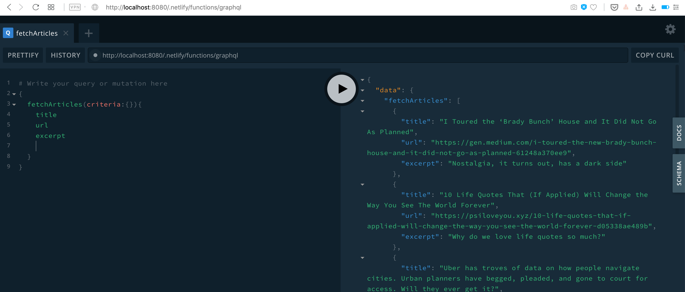

# Spanilla Service backend

Backend for Spanilla app

## Instructions on How to run locally

-   Add environment variables as mentioned in .env.sample
-   To start the api and jobs `yarn start`
-   Go to `http://localhost:8080`

## GraphQL Screenshot

## Most basic MongoDB commands (terminal)

-   `show dbs` --to show all dbs
-   `use inlineqadb` --to switch to inlineqadb
-   `show collections` --to show all collections/tables
-   `db.articles.find()` --to show all articles in the collection
-   `db.articles.find({title: 'new title'})` --to show article/articles with title = 'new title'
-   `db.articles.find({}, {title: 1})` --to show title field of all articles (no criteria)
-   `db.articles.remove({})` --to remove all articles documents
-   `db.articles.remove({title: 'new title'})` --to remove all articles with title = 'new title'
-   `db.articles.update({_id:{$exists:true}}, { $set: {createdDate: '2019-01-01'}}, {multi: true})` --to update multiple articles with createdDate = '2019-01-01'
